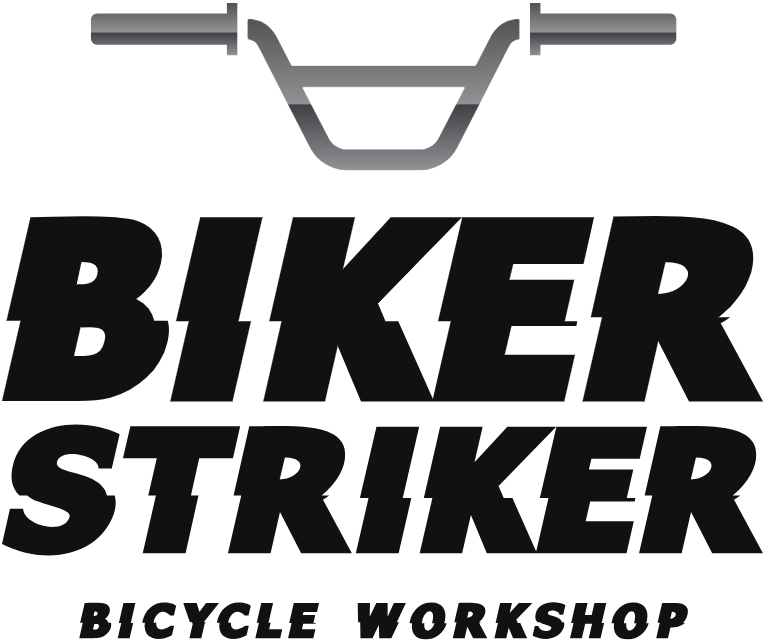

<p align="center">
  
</p>

<h1 align="center">BikerStriker</h1>

<p align="center">
  A desktop bike shop management system for repair services, invoicing, and inventory, built with C# WinForms and SQL Server.
  <br/>
  <strong>Programming III Final Project</strong> - Universidad Técnica Nacional (UTN)
</p>

<p align="center">
  
  
  
  
  
</p>

---

## About

BikerStriker is a full-stack desktop application built for managing a bicycle repair shop. It covers the entire service workflow, from registering customers and their bicycles, through creating work orders with photographic evidence, to generating invoices with PDF/XML output and email delivery. The system integrates with Costa Rica's Central Bank API (BCCR) for real-time exchange rates and supports multi-currency billing.

This project was developed as the final assignment for the Programming III course, demonstrating skills in object-oriented programming, relational database design, layered architecture, design patterns, and GUI development.

## Features

- **User authentication**: Login system with role-based access control
- **Three user roles:**
  - **Cliente (Customer)**: Register bicycles, request repairs, manage payment methods
  - **Vendedor (Technician)**: Process work orders, manage services and inventory
  - **Administrador**: Full system access, user management, store configuration, and reporting
- **Work order management**: Create repair orders linked to specific bicycles, attach before/after photos, capture digital signatures, and track completion dates
- **Invoicing system**: Generate invoices with automatic inventory adjustment, XML fiscal compliance documents, and PDF receipts
- **Inventory & product catalog**: Manage parts and services with categories, pricing in colones and dollars
- **Payment processing**: Support for Visa, Mastercard, and PayPal with card validation
- **Email delivery**: Automatic invoice dispatch with PDF + XML attachments via MailKit
- **QR code generation**: Embedded QR codes on invoices for quick reference
- **Real-time exchange rates**: Integration with BCCR (Banco Central de Costa Rica) for USD/CRC conversion
- **RDLC reports**: Work order reports with print and export functionality
- **CRUD maintenance modules**: Full management for customers, bicycles, brands, models, products, categories, technicians, administrators, contacts, and store settings

## Tech Stack

| Layer      | Technology                           |
| ---------- | ------------------------------------ |
| Language   | C# (.NET Framework 4.8)              |
| GUI        | Windows Forms (WinForms)             |
| Database   | Microsoft SQL Server                 |
| ORM / Data | ADO.NET (SqlCommand, SqlDataAdapter) |
| Reports    | QuestPDF + RDLC (ReportViewer)       |
| PDF        | QuestPDF 2024.10.4                   |
| Email      | MailKit 4.8.0 / MimeKit 4.8.0        |
| QR Codes   | QRCoder 1.6.0                        |
| JSON       | Newtonsoft.Json 13.0.3               |
| Logging    | log4net 3.0.2                        |
| Crypto     | BouncyCastle 2.4.0                   |
| IDE        | Visual Studio                        |

## Architecture

The project follows a multi-tier layered architecture with clear separation of concerns:

```
BikerStriker/
├── Layers/
│   ├── UI/                  # Presentation: WinForms (login, menus, maintenance, processes)
│   ├── BLL/                 # Business Logic: validation, orchestration, rules
│   ├── DAL/                 # Data Access: SQL queries, entity hydration
│   ├── Entities/            # Domain Model: POCOs, enums, inheritance hierarchy
│   ├── Persistencia/        # Persistence: DB connection, command execution, transactions
│   └── Reports/             # Reporting: PDF generation, RDLC templates
├── Interfaces/              # Contracts for BLL and DAL layers (28 interfaces)
├── Patrones/                # Design patterns: Facade & Factory implementations
├── Enums/                   # Type enumerations (roles, card types, gender, menu categories)
├── Util/                    # Utilities: BCCR API, QR codes, image handling, error logging
├── Extensions/              # C# extension methods
└── Resources/               # UI assets: logos, icons
```

**Entity hierarchy** uses OOP inheritance:

- `Usuario` (abstract) -> `Cliente`, `Vendedor`, `Administrador`
- `Producto` supports both physical parts and services (`EsServicio` flag)

**Design Patterns:**

| Pattern     | Implementation                                                                                |
| ----------- | --------------------------------------------------------------------------------------------- |
| **Facade**  | `BikerStrikerFacturaFacade`: orchestrates invoice save, PDF, XML, email, inventory adjustment |
| **Facade**  | `BikerStrikerOrdenTrabajoFacade`: orchestrates work order lifecycle                           |
| **Factory** | `FacturaFactory`, `OrdenDeTrabajoFactory`: entity creation with related data                  |
| **Factory** | `FactoryConexion`, `FactoryDataBase`: database connection management                          |

## Database Schema

The SQL Server database (`BikerStriker`) includes the following tables:

`Usuario` · `Cliente` · `Vendedor` · `Administrador` · `Bicicleta` · `Marca` · `Modelo` · `Producto` · `Categoria` · `Tarjeta` · `Contacto` · `OrdenTrabajo` · `OrdenDetalle` · `OrdenFoto` · `Factura` · `FacturaDetalle` · `Tienda` · `Dolar` · `Provincia` · `Canton` · `Distrito`

The full creation script is available in [`MSQLS_DBQuery.sql`](MSQLS_DBQuery.sql).

## Prerequisites

- Visual Studio 2019+ with .NET desktop development workload
- Microsoft SQL Server 2022
- .NET Framework 4.8 runtime

## Getting Started

1. **Clone the repository**

   ```bash
   git clone https://github.com/AndresBol/BikerStriker.git
   ```

2. **Set up the database**
   - Open SQL Server Management Studio
   - Execute the script [`MSQLS_DBQuery.sql`](MSQLS_DBQuery.sql) to create the database and tables

3. **Configure the connection**
   - Update credentials in `App.config` if needed:
     ```xml
     <connectionStrings>
       <add name="BikerStriker.Properties.Settings.SqlServer"
            connectionString="Data Source=localhost;Initial Catalog=BikerStriker;User ID=sa;Password=your_password"
            providerName="System.Data.SqlClient" />
     </connectionStrings>
     ```

4. **Restore NuGet packages**
   - Open the solution in Visual Studio
   - Right-click the solution -> Restore NuGet Packages

5. **Build and run**
   - Build the solution
   - Run, the entry point is the login form

## Login Credentials

| Role          | Email                   | Password    |
| ------------- | ----------------------- | ----------- |
| Administrator | `admin1@bikerstrike.cr` | `Admin123!` |
| Technician    | `vend1@bikerstrike.cr`  | `Vend123!`  |
| Regular User  | `cli1@correo.cr`        | `Cli1234!`  |

## Author

**Andrés Bolaños** - Student ID: 119090051

Universidad Técnica Nacional (UTN)

---

<p align="center">
  <sub>Built with C# WinForms as an academic project - 2024</sub>
</p>
